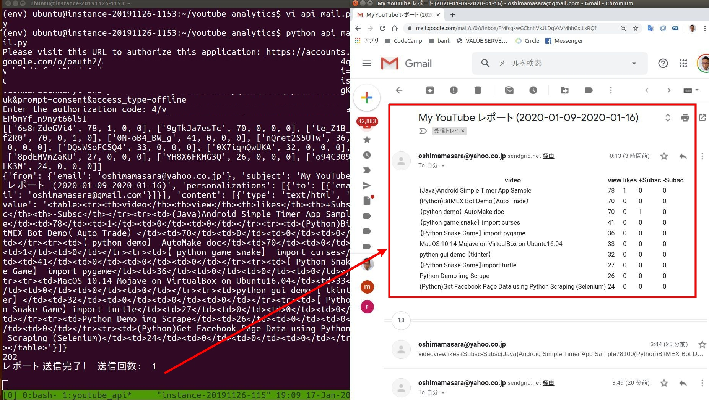

## Setting

+ Server :  Oracle Cloud(Free)
+ Mail Service :  SendGrid(Free)
+ YouTube API :  Analytics API,  Data API

### How to run Python in the background Server?

+ tmux


### Fllow

```set API Key & File```

1. Python Run
2. YouTube OAuth
3. Python keeps running in terminal
4. if the time, Python will send Mail to me
5. and Python keeps running in terminal ...

### YouTube API Key

+ [OAuth](https://developers.google.com/youtube/reporting/v1/code_samples/python#targeted-query-reports)
+ [Data API Key](https://youtu.be/81-OkTE02WQ)

### Video

[YouTube]()

### Default Setting

+ e-mail sending interval: 15min
+ YouTube Data:  Top 10 Video Views and Likes, + Subscribe, - Subscribe (Weekly)
